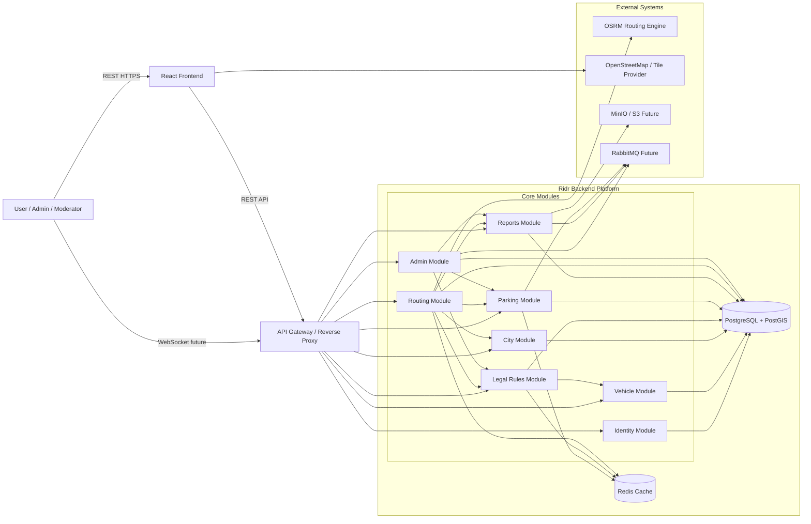
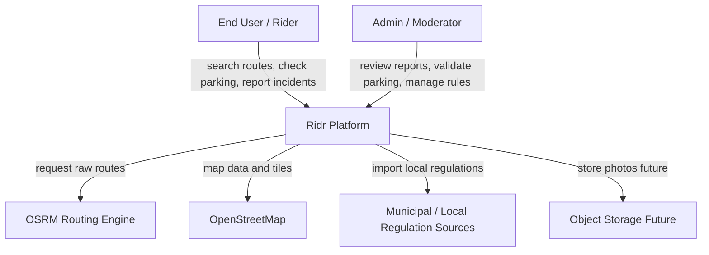
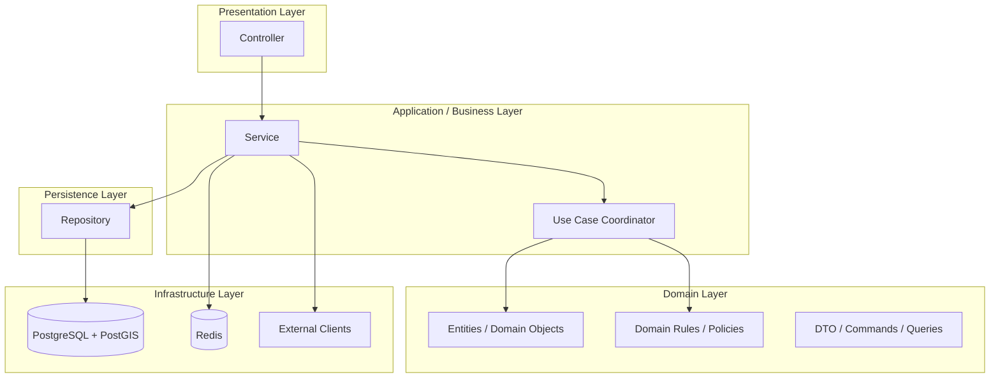
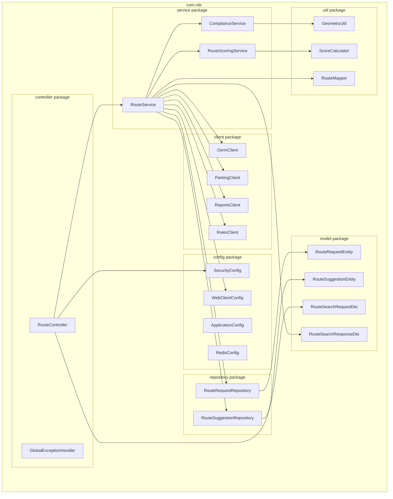
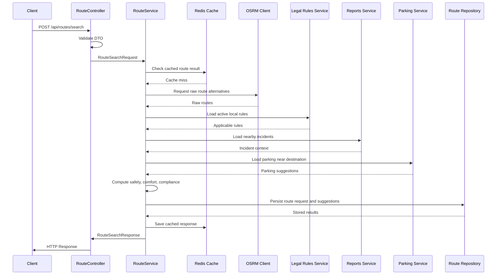

# 🏗️ Architecture

## System Diagrams

### Flowchart



## C4 Model Overview

### C1 — System Context Diagram



### C2 - Container Diagram

```mermaid
flowchart LR
    subgraph USERS["Users"]
        U1[End User]
        U2[Admin / Moderator]
    end

    subgraph CLIENTS["Client Applications"]
        FE[React Frontend]
    end

    subgraph SYSTEM["Ridr Platform"]
        APIGW[API Gateway / Reverse Proxy]

        subgraph CORE["Spring Boot Backend"]
            direction TB
            AUTH[Identity Module]
            VEH[Vehicle Module]
            CITY[City Module]
            RULE[Legal Rules Module]
            PARK[Parking Module]
            REP[Reports Module]
            ROUTE[Routing Module]
            ADMIN[Admin Module]
        end

        REDIS[(Redis Cache)]
        PG[(PostgreSQL + PostGIS)]
    end

    subgraph EXTERNAL["External Systems"]
        OSRM[OSRM Routing Engine]
        OSM[OpenStreetMap]
        MINIO[MinIO / S3 Future]
        MQ[RabbitMQ Future]
    end

    U1 --> FE
    U2 --> FE
    FE -->|REST / WebSocket future| APIGW

    APIGW --> AUTH
    APIGW --> VEH
    APIGW --> CITY
    APIGW --> RULE
    APIGW --> PARK
    APIGW --> REP
    APIGW --> ROUTE
    APIGW --> ADMIN

    AUTH --> PG
    VEH --> PG
    CITY --> PG
    RULE --> PG
    PARK --> PG
    REP --> PG
    ROUTE --> PG
    ADMIN --> PG

    PARK --> REDIS
    RULE --> REDIS
    ROUTE --> REDIS

    FE --> OSM
    ROUTE --> OSRM
    REP --> MINIO
    ADMIN --> MQ
    REP --> MQ
    PARK --> MQ
   ```

### C3 — Component Diagram (Reservation Service)

```mermaid
flowchart TB
    subgraph RM["Routing Module"]
        API[Route Controller]
        SVC[Route Service]
        OSRMCLIENT[OSRM Client]
        SCORE[Route Scoring Component]
        COMPLIANCE[Compliance Evaluator]
        INCIDENTS[Incident Context Loader]
        PARKING[Parking Context Loader]
        CACHE[Route Cache Adapter]
        REPO[Route Repository]
    end

    subgraph DB["Platform Data"]
        PG[(PostgreSQL + PostGIS)]
        REDIS[(Redis)]
    end

    subgraph EXT["Dependencies"]
        OSRM[OSRM Routing Engine]
        RULEMOD[Legal Rules Module]
        REPMOD[Reports Module]
        PARKMOD[Parking Module]
        CITYMOD[City Module]
    end

    API --> SVC
    SVC --> OSRMCLIENT
    SVC --> SCORE
    SVC --> COMPLIANCE
    SVC --> INCIDENTS
    SVC --> PARKING
    SVC --> CACHE
    SVC --> REPO

    OSRMCLIENT --> OSRM
    COMPLIANCE --> RULEMOD
    COMPLIANCE --> CITYMOD
    INCIDENTS --> REPMOD
    PARKING --> PARKMOD
    REPO --> PG
    CACHE --> REDIS
    SCORE --> PG
```

# 🧩 N-Layer Architecture (inside each microservice)






## ✅ Layer Responsibilities

| Layer | Package | Purpose | Example classes |
|----------------------------|------------------|------------------------------------------------------|-----------------------------------------------|
| **Presentation Layer** | `controller` | Exposes REST endpoints, handles input/output mapping | `RouteController`, `ParkingController`, `ReportController` |
| **Business Layer** | `service` | Implements business logic and cross-module orchestration | `RouteService`, `ParkingService`, `LegalRuleService` |
| **Persistence Layer** | `repository` | Handles relational and geospatial database access using JPA and PostGIS | `RouteRequestRepository`, `ParkingSpotRepository`, `LocalRuleRepository` |
| **Domain / Data Models** | `model` | Contains JPA entities, DTOs, commands, queries, and scoring models | `RouteRequestEntity`, `ParkingSpotEntity`, `LocalRuleEntity`, `RouteSearchRequestDto` |
| **Infrastructure Layer** | `client`, `config` | Handles external integrations, cache, security, and technical adapters | `OsrmClient`, `RedisConfig`, `SecurityConfig`, `WebClientConfig` |
| **Cross-Cutting Concerns** | `common`, `util`, `audit` | Shared utilities, exception handling, logging, audit, and mapping helpers | `GlobalExceptionHandler`, `GeometryUtil`, `AuditService`, `RouteMapper` |

# Key notes:

- API Gateway is the single entry point for frontend clients and future mobile applications.
- The Routing Module is the main orchestrator of the platform: it receives route requests, calls the routing engine, evaluates legal constraints, loads nearby incidents, checks parking options, and computes route scores.
- The Legal Rules Module is one of the most important differentiators of Ridr because it allows city-specific and vehicle-specific restrictions to be modeled as configurable data instead of hardcoded logic.
- The Parking Module and Reports Module rely heavily on PostgreSQL + PostGIS for proximity search, spatial filtering, and zone-aware validations.
- Redis is used as a performance optimization layer for route caching, nearby parking lookups, and frequently requested city rules.
- The Admin Module is responsible for moderation and validation workflows, turning community-submitted data into trusted operational data.
- Ridr starts as a modular monolith to reduce operational complexity while still preserving strong internal domain boundaries.
- If the platform grows significantly, the most likely future extraction candidates are the Routing Module, Reports Module, Admin Module, and Identity Module.
