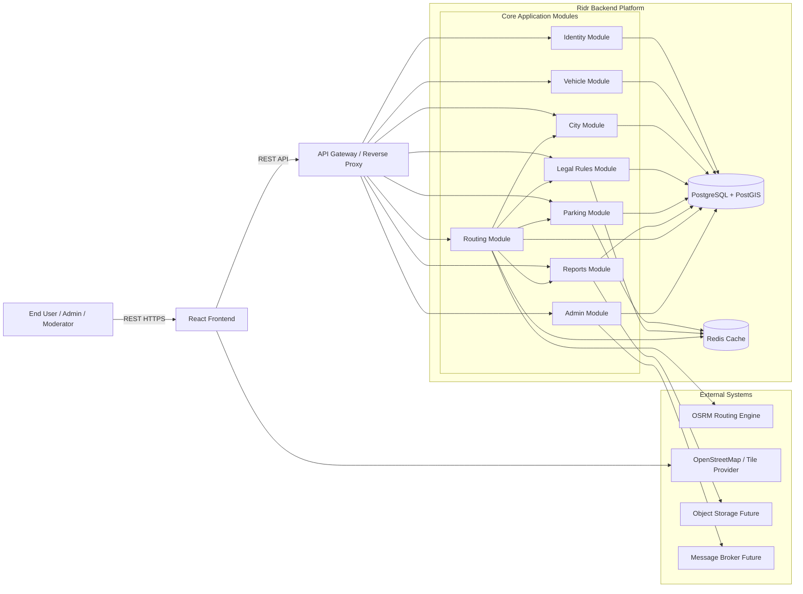
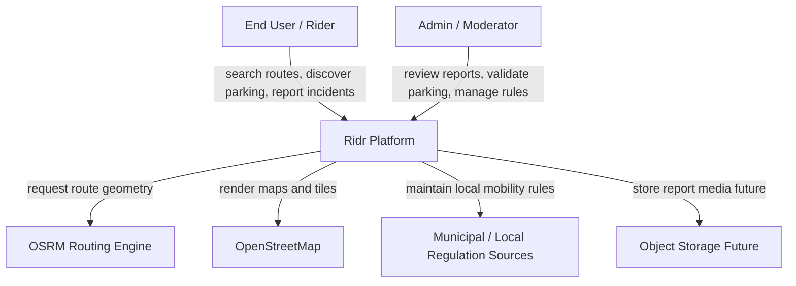
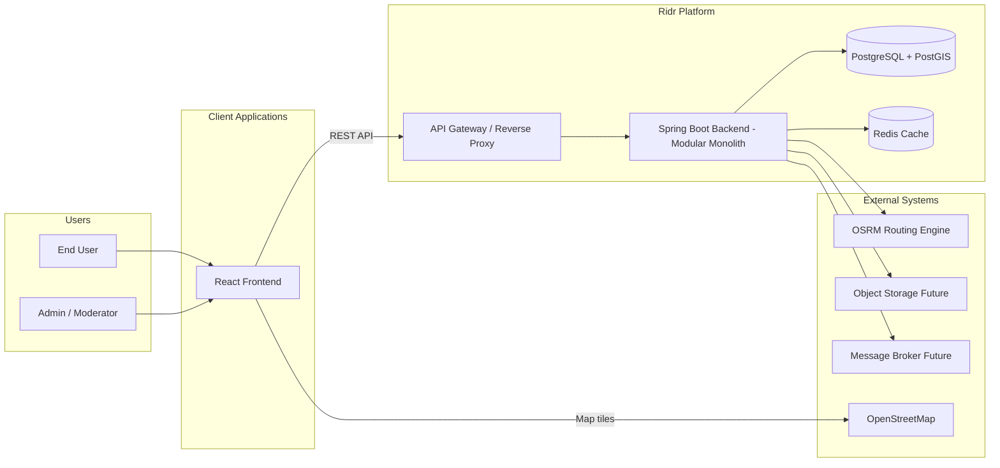
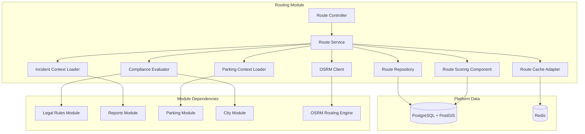
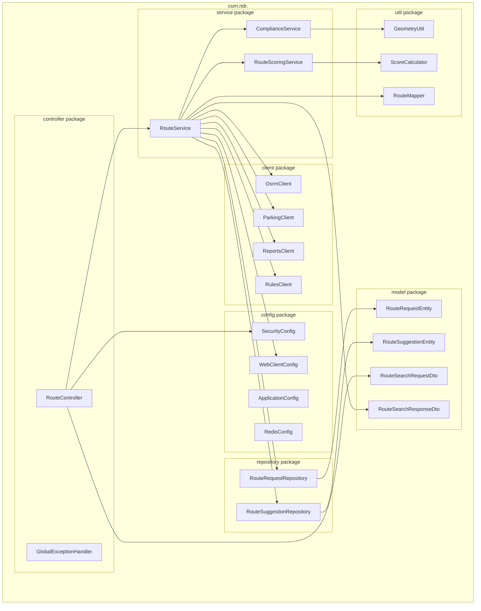

# 🏗️ Architecture

This document describes the architectural design of the **Ridr** platform.

Ridr is built as a **modular monolith** in the first phase.  
This architecture provides:
- clear internal boundaries between domains
- simpler development and deployment
- lower operational complexity
- an easy future path toward service extraction if the platform grows significantly

---

## Architecture Style

**Architecture Style:** Modular Monolith

### Why this approach?
- the project is still in an early product stage
- business logic is complex, but operational scale is still manageable
- strong module boundaries are needed, but microservices would add unnecessary infrastructure complexity
- the system can later evolve toward service decomposition if traffic, team size, or operational constraints justify it

---

## System Diagrams

### Flowchart

## C4 Model Overview

### C1 — System Context Diagram

### C2 - Container Diagram

### C3 — Component Diagram (Reservation Service)

# 🧩 N-Layer Architecture (inside each microservice)

## ✅ Layer Responsibilities

| Layer | Package | Purpose | Example classes |
|----------------------------|------------------|------------------------------------------------------|-----------------------------------------------|
| **Presentation Layer** | `controller` | Exposes REST endpoints, handles input/output mapping | `RouteController`, `ParkingController`, `ReportController` |
| **Business Layer** | `service` | Implements business logic and cross-module orchestration | `RouteService`, `ParkingService`, `LegalRuleService` |
| **Persistence Layer** | `repository` | Handles relational and geospatial database access using JPA and PostGIS | `RouteRequestRepository`, `ParkingSpotRepository`, `LocalRuleRepository` |
| **Domain / Data Models** | `model` | Contains JPA entities, DTOs, commands, queries, and scoring models | `RouteRequestEntity`, `ParkingSpotEntity`, `LocalRuleEntity`, `RouteSearchRequestDto` |
| **Infrastructure Layer** | `client`, `config` | Handles external integrations, cache, security, and technical adapters | `OsrmClient`, `RedisConfig`, `SecurityConfig`, `WebClientConfig` |
| **Cross-Cutting Concerns** | `common`, `util`, `audit` | Shared utilities, exception handling, logging, audit, and mapping helpers | `GlobalExceptionHandler`, `GeometryUtil`, `AuditService`, `RouteMapper` |

# Key notes:

- API Gateway is the single entry point for frontend clients and future mobile applications.
- The Routing Module is the main orchestrator of the platform: it receives route requests, calls the routing engine, evaluates legal constraints, loads nearby incidents, checks parking options, and computes route scores.
- The Legal Rules Module is one of the most important differentiators of Ridr because it allows city-specific and vehicle-specific restrictions to be modeled as configurable data instead of hardcoded logic.
- The Parking Module and Reports Module rely heavily on PostgreSQL + PostGIS for proximity search, spatial filtering, and zone-aware validations.
- Redis is used as a performance optimization layer for route caching, nearby parking lookups, and frequently requested city rules.
- The Admin Module is responsible for moderation and validation workflows, turning community-submitted data into trusted operational data.
- Ridr starts as a modular monolith to reduce operational complexity while still preserving strong internal domain boundaries.
- If the platform grows significantly, the most likely future extraction candidates are the Routing Module, Reports Module, Admin Module, and Identity Module.
