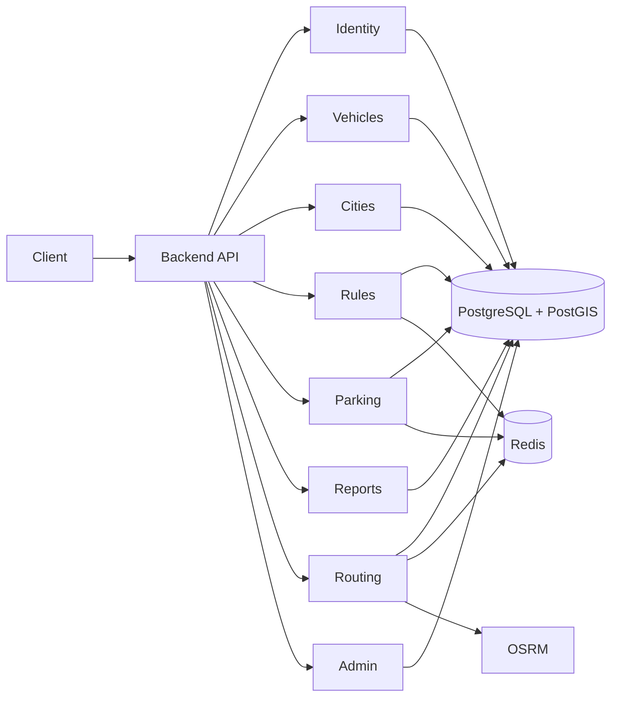

cat << 'EOF' > docs/communication/communication.md
# Communication

This document describes how different components of the Ridr platform communicate.

Ridr uses:
- synchronous REST communication for core flows
- external HTTP communication for routing
- Redis for caching
- optional future async messaging (RabbitMQ)
- optional real-time updates (WebSocket)

---

## 🔌 REST Endpoints Overview

### Identity Module

POST /api/auth/register  
POST /api/auth/login  
POST /api/auth/refresh  
GET  /api/auth/me

---

### Vehicle Module

GET    /api/vehicles/types  
GET    /api/vehicles/my  
POST   /api/vehicles  
PUT    /api/vehicles/{id}  
DELETE /api/vehicles/{id}

---

### City Module

GET /api/cities  
GET /api/cities/{id}  
GET /api/cities/{id}/rules  
GET /api/cities/{id}/parking  
GET /api/cities/{id}/reports

---

### Legal Rules Module

GET    /api/rules  
GET    /api/rules/{id}  
POST   /api/admin/rules  
PUT    /api/admin/rules/{id}  
DELETE /api/admin/rules/{id}

---

### Parking Module

GET  /api/parking-spots/nearby  
GET  /api/parking-spots/{id}  
POST /api/parking-spots  
PUT  /api/parking-spots/{id}  
POST /api/admin/parking-spots/{id}/validate

---

### Reports Module

GET  /api/reports/nearby  
GET  /api/reports/{id}  
POST /api/reports  
POST /api/admin/reports/{id}/review

---

### Routing Module

POST /api/routes/search  
GET  /api/routes/{id}  
GET  /api/routes/{id}/parking-options

---

### Admin Module

POST   /api/admin/rules  
PUT    /api/admin/rules/{id}  
DELETE /api/admin/rules/{id}  
POST   /api/admin/parking-spots/{id}/validate  
POST   /api/admin/reports/{id}/review

---

## 🌐 Core Communication Paths

### 1. Client → Backend

Used for:
- authentication
- route search
- parking discovery
- report submission
- admin operations

Protocol:
- HTTPS REST

---

### 2. Backend → PostgreSQL/PostGIS

Used for:
- transactional data storage
- spatial queries
- route-related geo checks
- rule evaluation

---

### 3. Backend → Redis

Used for:
- caching route results
- caching nearby parking
- caching city rules

---

### 4. Backend → OSRM

Used for:
- raw route computation
- route alternatives
- distance and duration estimation

Protocol:
- HTTP

---

## 💬 Example Requests

### Route Search Request

{
"origin": {
"lat": 44.4268,
"lng": 26.1025
},
"destination": {
"lat": 44.4350,
"lng": 26.1200
},
"vehicleType": "E_SCOOTER",
"cityId": "city-123",
"preferences": {
"preferSafeRoutes": true,
"preferLegalRoutes": true
}
}

---

### Route Search Response

{
"routeId": "route-456",
"distanceMeters": 4200,
"estimatedDurationSeconds": 900,
"safetyScore": 82,
"comfortScore": 75,
"complianceScore": 91,
"warnings": [
"High traffic area near destination",
"Limited parking availability"
]
}

---

### Report Submission

{
"type": "POTHOLE",
"severity": "HIGH",
"location": {
"lat": 44.4312,
"lng": 26.1110
},
"description": "Large pothole in bike lane"
}

---

## 🔔 WebSocket Channels (Future)

| Channel | Purpose |
|--------|--------|
| /topic/routes/{userId} | Route updates |
| /topic/reports/{cityId} | New incident alerts |
| /topic/system/alerts | System-wide alerts |

Example message:

{
"type": "INCIDENT_NEARBY",
"message": "New hazard reported near your route"
}

---

## 🔄 Optional Async Events (Future)

### incident.reported

{
"reportId": "rep-001",
"cityId": "city-123",
"type": "POTHOLE",
"severity": "HIGH"
}

### parking.validated

{
"parkingSpotId": "park-001",
"status": "APPROVED"
}

---

## 🌐 Global Communication Overview

