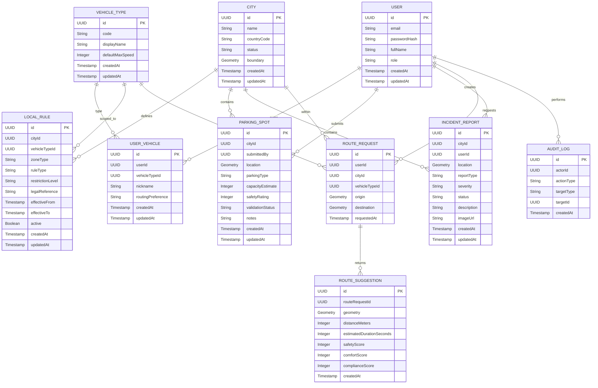
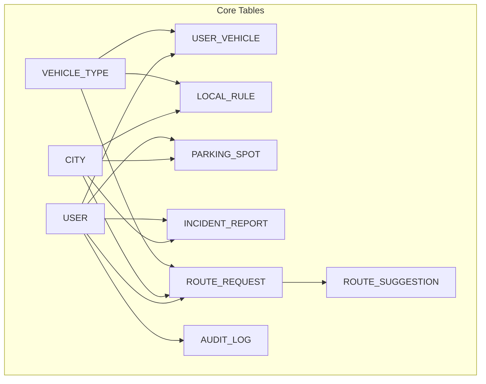

# 🗃️ Data Model

This document describes the core data model of the Ridr platform.

Ridr combines:
- relational data
- geospatial data
- moderation state
- route-related scoring context

The model is designed to support:
- users and authentication
- city-specific rules
- vehicle-aware routing
- parking discovery
- community incident reports
- route request history
- route suggestions with enriched metadata

---

## Data Model Overview

The Ridr platform relies on **PostgreSQL + PostGIS** as the primary data store.

This choice enables:
- standard transactional persistence
- geospatial indexing
- radius-based queries
- zone validation
- route geometry storage
- city boundary management

---

## ER Diagram

