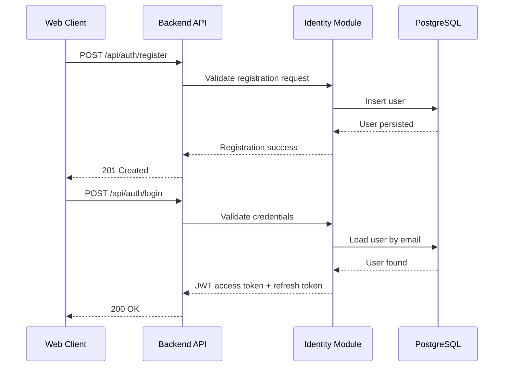
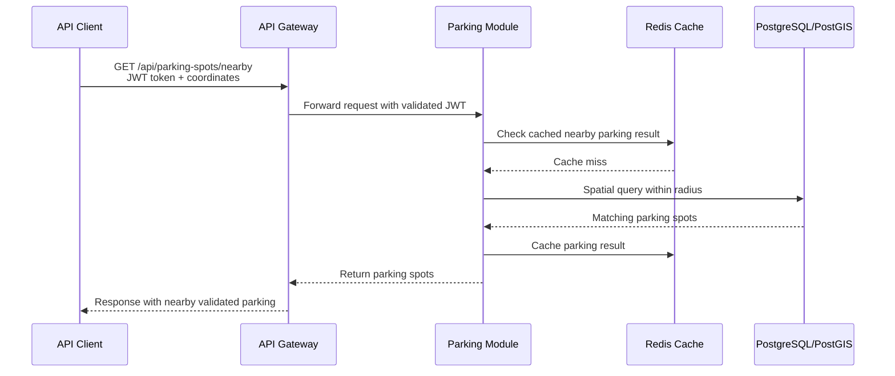
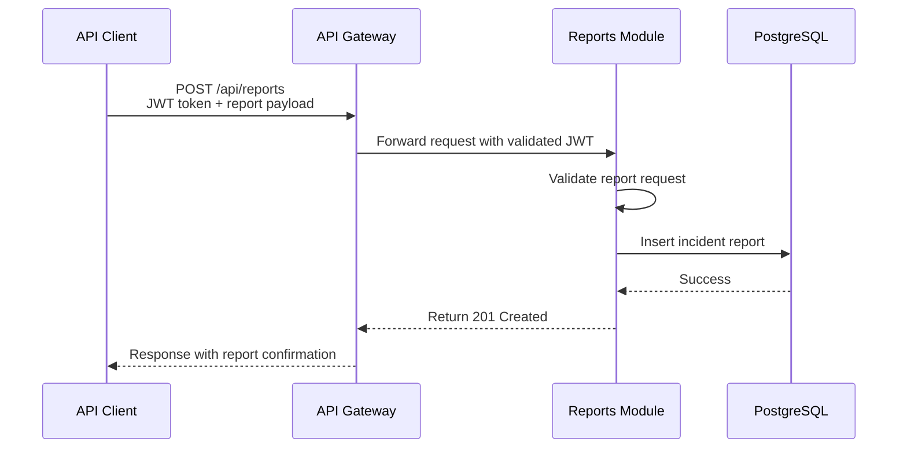
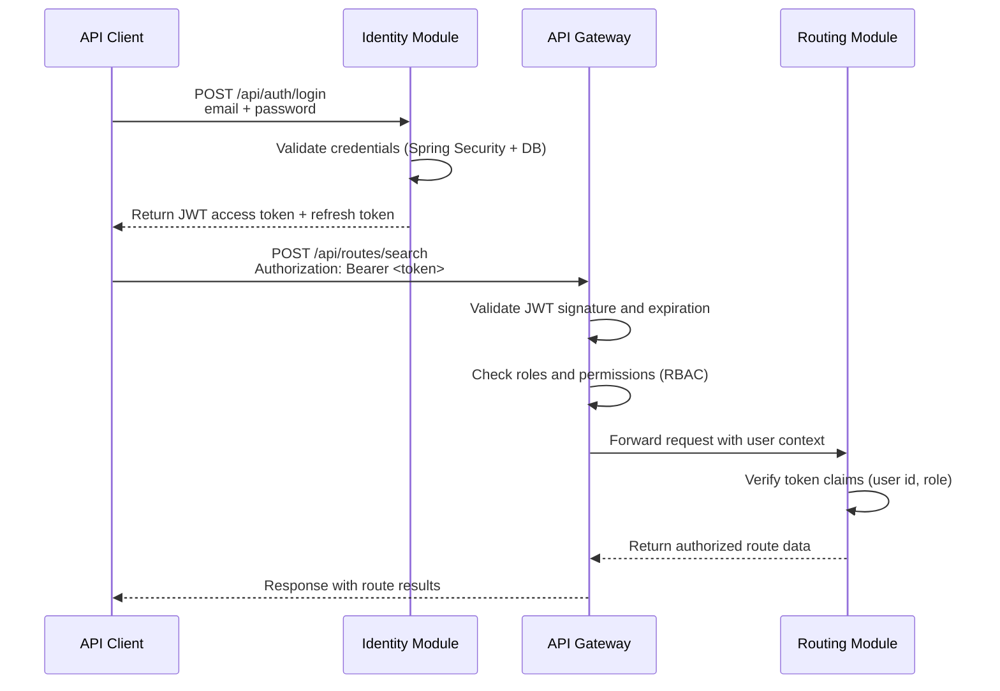
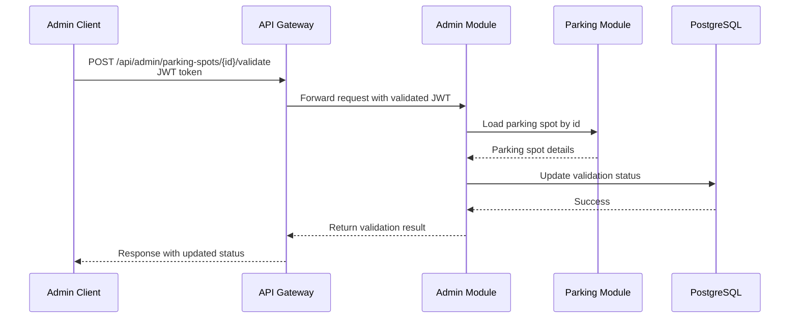
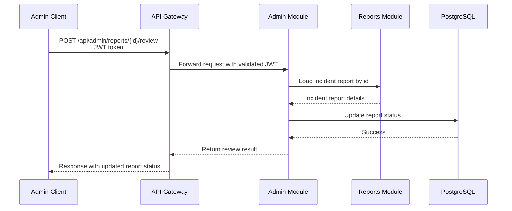
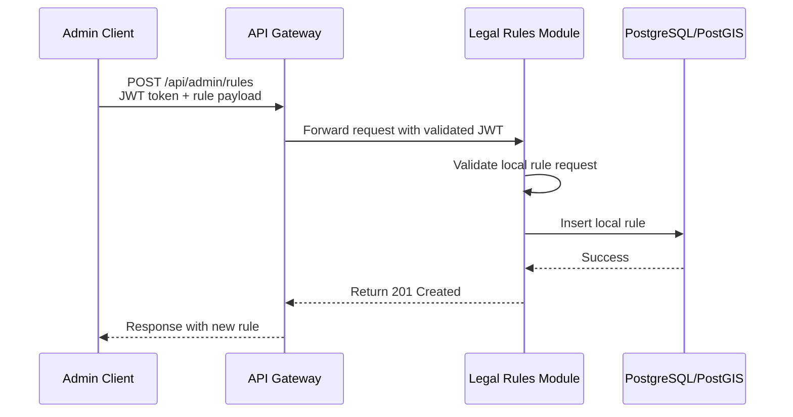
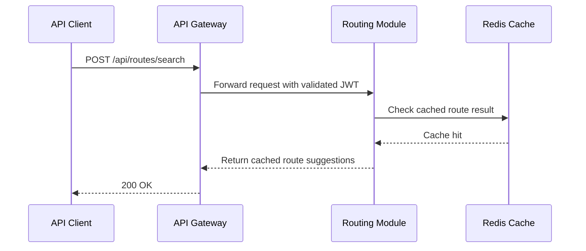
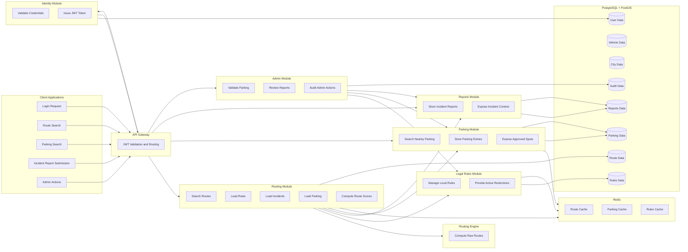

# 🔁 Typical Flows

This document describes the most important business and system flows in the Ridr platform.

The flows below cover:
- authentication
- user profile setup
- route search
- parking discovery
- report submission
- moderation workflows

These flows reflect the current architecture of Ridr as a **modular monolith** with external route computation through **OSRM**.

---

## 🧩 Flow 1 — User Registration and Login

### 🧠 Flow Description

| Step | Action                                      | Notes                                   |
|------|---------------------------------------------|-----------------------------------------|
| 1    | Client sends route request with JWT         | Gateway authenticates token             |
| 2    | Routing Module checks cache                 | Avoids repeated expensive computations  |
| 3    | OSRM generates raw route alternatives       | Provides base route geometry            |
| 4    | System loads rules, incidents, parking      | Adds business context                   |
| 5    | Route suggestions are computed and scored   | Safety, comfort, compliance             |
| 6    | Route data is stored and cached             | Improves future performance             |
| 7    | Final response returned to client           | Includes enriched route options         |

## 🧩 Flow 2 — Nearby Parking Discovery

### 🧠 Flow Description

| Step | Action                                      | Notes                                  |
|------|---------------------------------------------|----------------------------------------|
| 1    | Client requests nearby parking              | Based on location or destination       |
| 2    | Parking Module checks cache                | Speeds up repeated queries             |
| 3    | Spatial query executed in PostGIS          | Uses radius-based filtering            |
| 4    | Matching parking spots retrieved           | Includes validation status             |
| 5    | Results cached                             | Improves subsequent lookups            |
| 6    | Response returned to client                | Contains nearby parking options        |

## 🧩 Flow 3 — Submit Incident Report

### 🧠 Flow Description
| Step | Action                                      | Notes                                  |
|------|---------------------------------------------|----------------------------------------|
| 1    | Client submits incident report              | Includes type, severity, location      |
| 2    | Reports Module validates request           | Ensures valid input data               |
| 3    | Report stored in database                  | Becomes part of system context         |
| 4    | Confirmation returned to client            | Report successfully registered         |

## 🧩 Flow 4 — Authentication and Authorization

### 🧠 Flow Description

| Step | Action                                      | Notes                                           |
|------|---------------------------------------------|-------------------------------------------------|
| 1    | Client sends login credentials              | Email and password provided                    |
| 2    | Identity Module validates credentials       | Uses secure hashing and DB lookup              |
| 3    | JWT token issued                            | Contains user identity and roles               |
| 4    | Client sends authenticated request          | Uses Bearer token                              |
| 5    | Gateway validates token                     | Signature, expiry, and roles                   |
| 6    | Request forwarded with user context         | Enables downstream authorization               |
| 7    | Authorized response returned                | Only allowed data is exposed                   |

## 🧩 Flow 5 — Validate Parking Spot

### 🧠 Flow Description

| Step | Action                                      | Notes                                  |
|------|---------------------------------------------|----------------------------------------|
| 1    | Admin requests validation of parking spot   | Requires elevated privileges           |
| 2    | Parking data is loaded                     | Ensures correct entity is reviewed     |
| 3    | Validation status updated                  | Approved or rejected                   |
| 4    | Updated result returned                    | Influences future recommendations      |

## 🧩 Flow 6 — Review Incident Report

### 🧠 Flow Description

| Step | Action                                      | Notes                                  |
|------|---------------------------------------------|----------------------------------------|
| 1    | Admin reviews incident report              | Moderation process                     |
| 2    | Report data is loaded                      | Ensures correct context                |
| 3    | Report status updated                      | Reviewed, resolved, or rejected        |
| 4    | Result returned                            | Affects routing relevance              |

## 🧩 Flow 7 — Create Local Rule

### 🧠 Flow Description

| Step | Action                                      | Notes                                  |
|------|---------------------------------------------|----------------------------------------|
| 1    | Admin creates local rule                   | Defines city-specific constraint       |
| 2    | Rule data validated                        | Ensures consistency                    |
| 3    | Rule stored in database                    | Immediately usable by routing          |
| 4    | Confirmation returned                      | Rule successfully created              |

## 🧩 Flow 8 — Route Search (Cache Hit)

### 🧠 Flow Description

| Step | Action                                      | Notes                                  |
|------|---------------------------------------------|----------------------------------------|
| 1    | Client sends route request                 | Same or similar query                  |
| 2    | Routing Module checks cache                | Finds existing result                  |
| 3    | Cached result returned                     | No OSRM or DB recomputation            |
| 4    | Response sent to client                    | Faster user experience                 |

## ✅ Summary of All Flows

| Flow | Type | Key Components | Communication |
|------|------|----------------|---------------|
| 1. Route Search | Core | Routing Module, OSRM, Legal Rules, Reports, Parking | REST + HTTP + Redis |
| 2. Nearby Parking Discovery | Core | Parking Module, Redis, PostGIS | REST |
| 3. Submit Incident Report | Core | Reports Module, PostgreSQL | REST |
| 4. Authentication and Authorization | Security | Identity Module, API Gateway | REST + JWT |
| 5. Validate Parking Spot | Moderation | Admin Module, Parking Module | REST |
| 6. Review Incident Report | Moderation | Admin Module, Reports Module | REST |
| 7. Create Local Rule | Administration | Admin Module, Legal Rules Module | REST |
| 8. Route Search (Cache Hit) | Performance | Routing Module, Redis | REST |

## 🌐 Global Interaction Overview — IntelliJ-Compatible

### 🧠 Diagram Explanation

| Area | Description | Notes |
|------|-------------|-------|
| CLIENT | Represents frontend or external clients interacting with the platform | Includes end users, admins, and moderators |
| GATEWAY | Single entry point that validates JWT and routes requests | Centralizes access control and request forwarding |
| AUTH | Handles authentication and token issuing | Responsible for login, registration, and JWT lifecycle |
| ROUTING | Main orchestrator for route computation and enrichment | Combines OSRM output with rules, reports, and parking context |
| PARKING | Manages parking spots and nearby parking discovery | Uses PostGIS and validation state for trusted recommendations |
| REPORTS | Stores and exposes community-submitted incident data | Provides hazard context for route scoring |
| RULES | Stores and provides legal and local mobility restrictions | Enables city-specific and vehicle-specific compliance logic |
| ADMIN | Handles moderation, validation, and audit-sensitive operations | Maintains trusted platform data |
| OSRM | External engine for raw route calculation | Provides route geometry, distance, and duration |
| CACHE | Redis stores repeated lookup results | Improves performance for routes, parking, and rules |
| DB | PostgreSQL + PostGIS stores business and geospatial data | Primary source of truth for transactional and spatial records |

### 🚦 Key Communication Types

| Communication Type | Examples | Technologies | Notes |
|--------------------|----------|-------------|-------|
| REST (Sync) | `/api/auth/login`, `/api/routes/search`, `/api/reports` | Spring Web | Main communication style for user-facing operations |
| External HTTP | Route calculation against OSRM | WebClient / HTTP | Used by Routing Module to obtain raw route candidates |
| Caching | Routes, rules, parking lookups | Redis | Reduces repeated expensive operations |
| Geospatial Persistence | Parking, reports, route geometry, city boundaries | PostgreSQL + PostGIS | Supports radius queries, zone checks, and geometry storage |
| Security | Authentication and RBAC enforcement | JWT + API Gateway | Protects endpoints and scopes access by role |
| Future Async Messaging | Report and moderation events | RabbitMQ | Planned for future event-driven processing |
| Future Real-Time Updates | Hazard alerts, live route notifications | WebSocket | Planned for future user-facing live updates |
