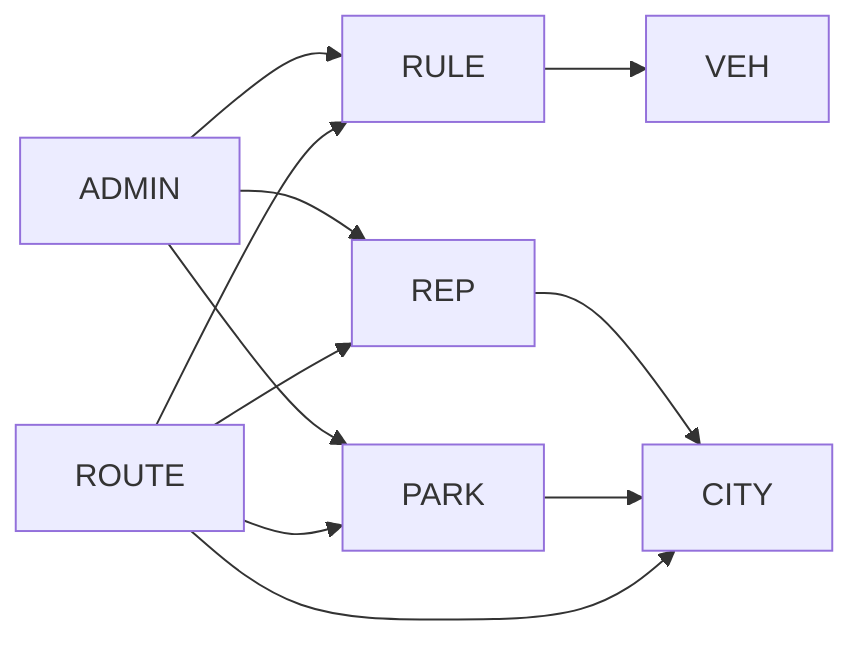

# 🧩 Services / Modules

This document describes the main modules of the Ridr platform.

Ridr is implemented as a **modular monolith**, meaning:
- a single deployable backend application
- internally separated domain modules
- clear ownership of data and logic
- future-ready for possible microservice extraction

---

## 🧩 Module Overview

| Module | Responsibilities | Communication |
|--------|------------------|---------------|
| **Identity Module** | Authentication, user management, JWT tokens | REST |
| **Vehicle Module** | Vehicle types and user vehicle profiles | REST |
| **City Module** | City metadata and boundaries | REST |
| **Legal Rules Module** | Local mobility rules and restrictions | REST |
| **Parking Module** | Parking spots, validation, geo queries | REST + PostGIS + Redis |
| **Reports Module** | Incident reports and hazard tracking | REST |
| **Routing Module** | Route computation and scoring | REST + HTTP (OSRM) + Redis |
| **Admin Module** | Moderation, validation, audit actions | REST |

---

## 🔐 Identity Module

### Responsibilities
- user registration
- login and authentication
- JWT token issuing and refresh
- role-based access control

### Key Endpoints
POST /api/auth/register  
POST /api/auth/login  
POST /api/auth/refresh  
GET  /api/auth/me

### Notes
- central entry point for security
- integrates with Spring Security
- used by all protected endpoints

---

## 🚲 Vehicle Module

### Responsibilities
- define supported vehicle types
- manage user vehicle profiles
- provide routing preferences per vehicle

### Key Endpoints
GET  /api/vehicles/types  
GET  /api/vehicles/my  
POST /api/vehicles

### Notes
- used by Routing Module to adapt route behavior
- supports future features like battery-aware routing

---

## 🏙️ City Module

### Responsibilities
- manage supported cities
- store geographic boundaries
- provide city context for routing and rules

### Key Endpoints
GET /api/cities  
GET /api/cities/{id}

### Notes
- defines operational scope of the platform
- enables multi-city expansion

---

## ⚖️ Legal Rules Module

### Responsibilities
- define city-specific mobility rules
- define restrictions per vehicle type
- provide compliance data to routing

### Key Endpoints
GET /api/rules  
POST /api/admin/rules

### Notes
- one of the core differentiators of Ridr
- rules are stored as data, not hardcoded logic

---

## 🅿️ Parking Module

### Responsibilities
- store parking spots
- perform geospatial queries
- manage validation state
- support community submissions

### Key Endpoints
GET  /api/parking-spots/nearby  
POST /api/parking-spots

### Notes
- heavily relies on PostGIS
- integrates with routing for destination suggestions

---

## 🚧 Reports Module

### Responsibilities
- accept incident reports
- track hazard severity
- provide context for route scoring

### Key Endpoints
GET  /api/reports/nearby  
POST /api/reports

### Notes
- community-driven data source
- directly impacts route safety scoring

---

## 🧭 Routing Module

### Responsibilities
- process route requests
- integrate with OSRM
- enrich routes with:
    - legal rules
    - incident data
    - parking data
- compute route scores

### Key Endpoints
POST /api/routes/search

### Notes
- main business logic of the platform
- orchestrates multiple modules
- transforms raw routes into intelligent routes

---

## 🛠️ Admin Module

### Responsibilities
- validate parking spots
- review incident reports
- manage local rules
- perform audit logging

### Key Endpoints
POST /api/admin/parking-spots/{id}/validate  
POST /api/admin/reports/{id}/review

### Notes
- ensures data quality
- enables moderation workflows
- critical for real-world usage

---

## 🔄 Inter-Module Communication

