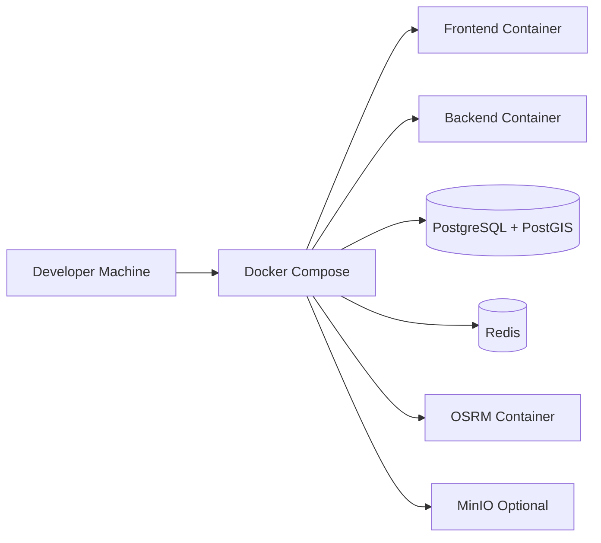

# ⚙️ Pipeline / Tooling

This document describes the development workflow, build pipeline, and supporting tooling for the Ridr platform.

The goal of this pipeline is to ensure:
- repeatable local development
- consistent builds
- automated validation
- maintainable deployment flow
- controlled evolution of the codebase

---

## 🧭 Development Workflow

The recommended day-to-day workflow is:

1. pull latest changes from the repository
2. start local infrastructure
3. run backend and frontend
4. develop features in isolated branches
5. run tests before committing
6. push changes through pull requests
7. validate through CI before merge

This keeps development predictable and reduces integration issues.

---

## 🐳 Local Development Stack

### Core Local Services
- backend application
- frontend application
- PostgreSQL + PostGIS
- Redis
- OSRM

### Optional Local Services
- MinIO
- SonarQube

The local stack is expected to run through **Docker Compose**.

---

## 🧩 Local Environment Topology

